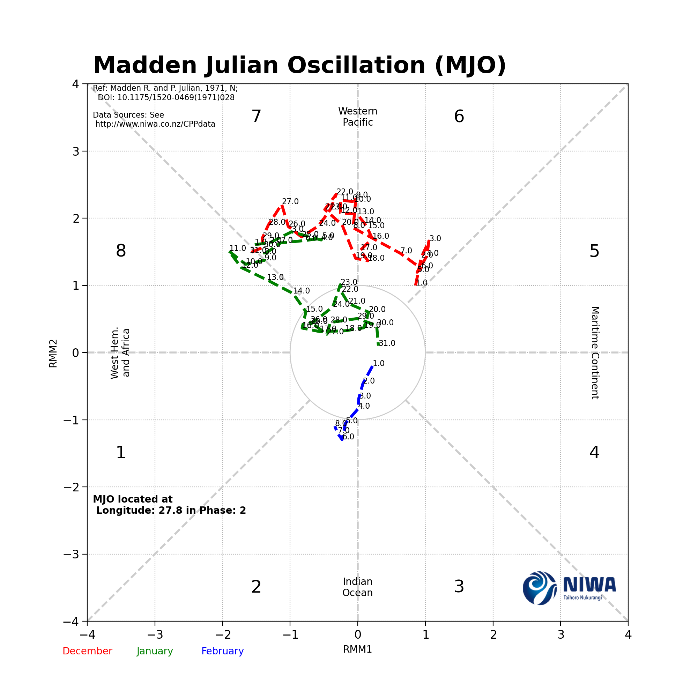
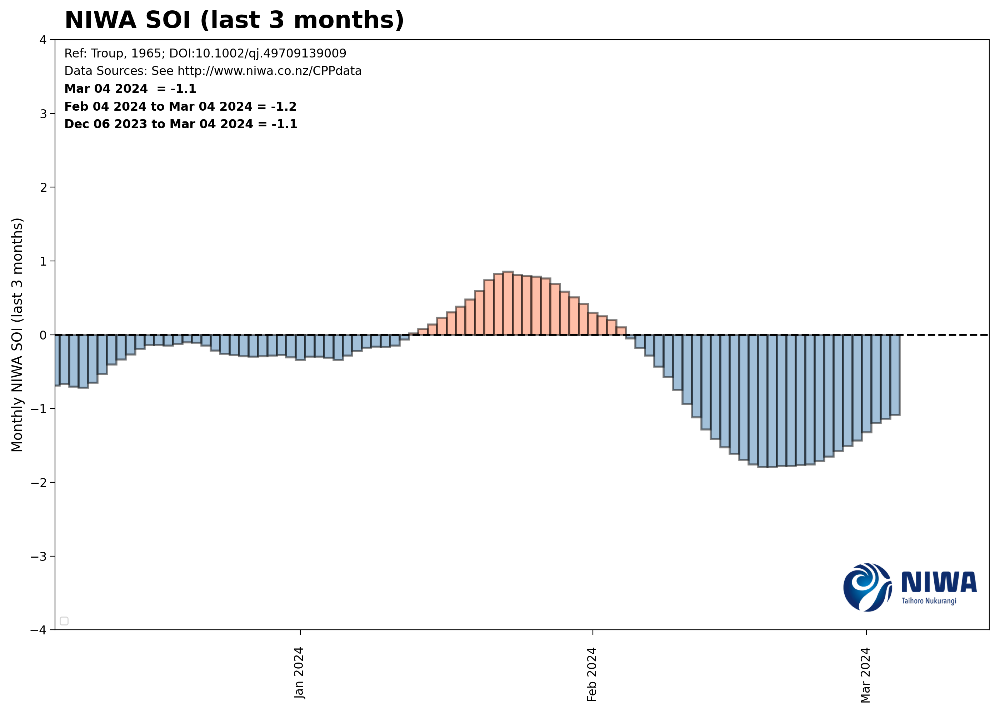
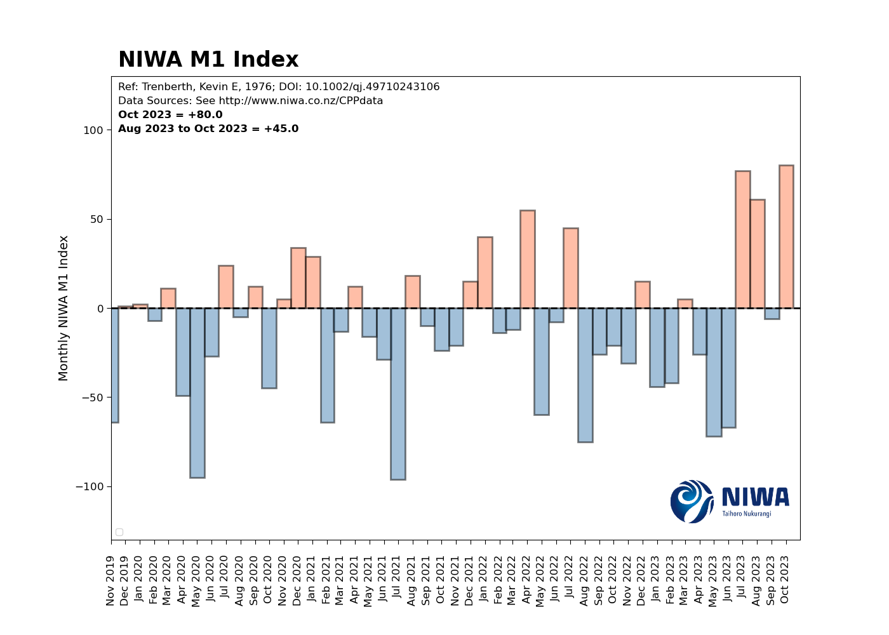
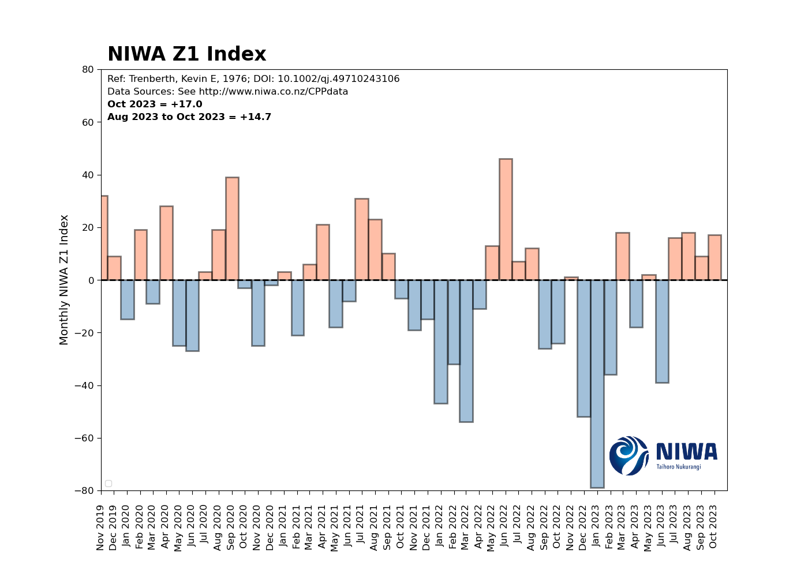
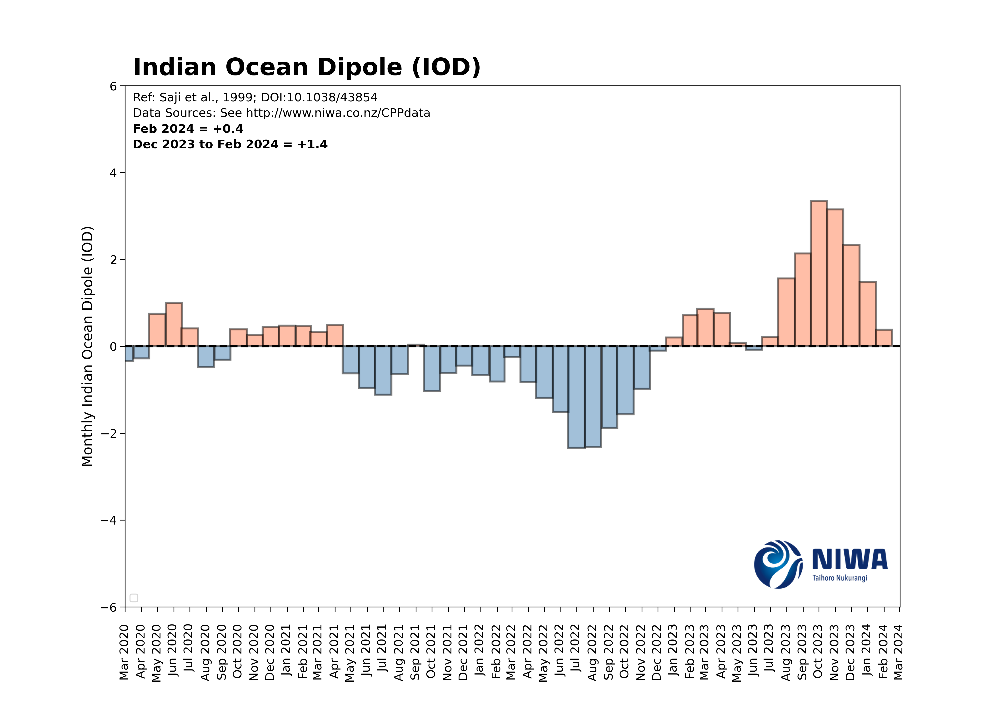
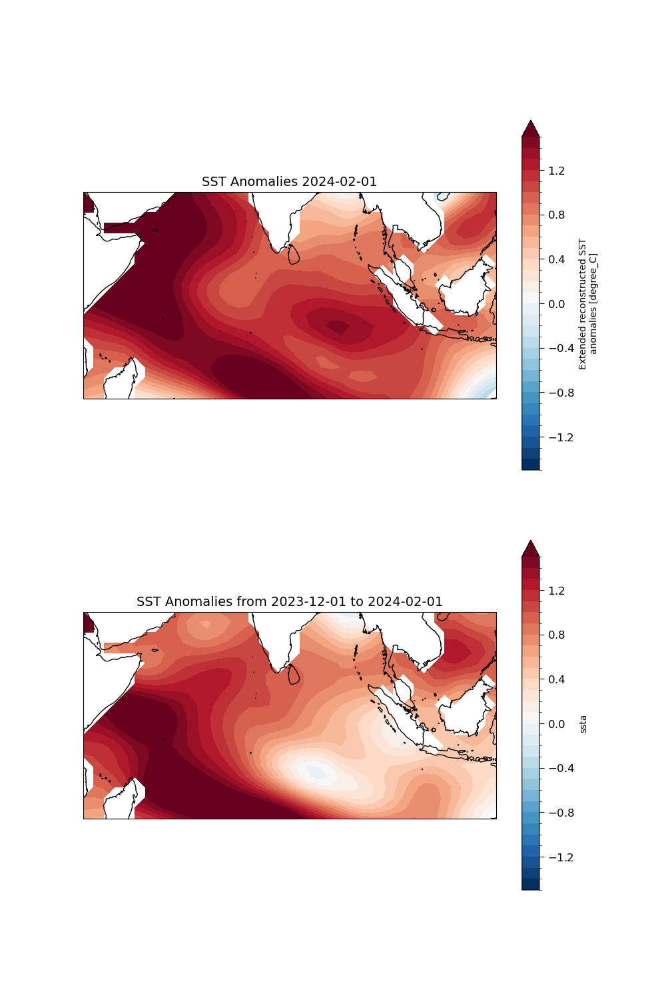
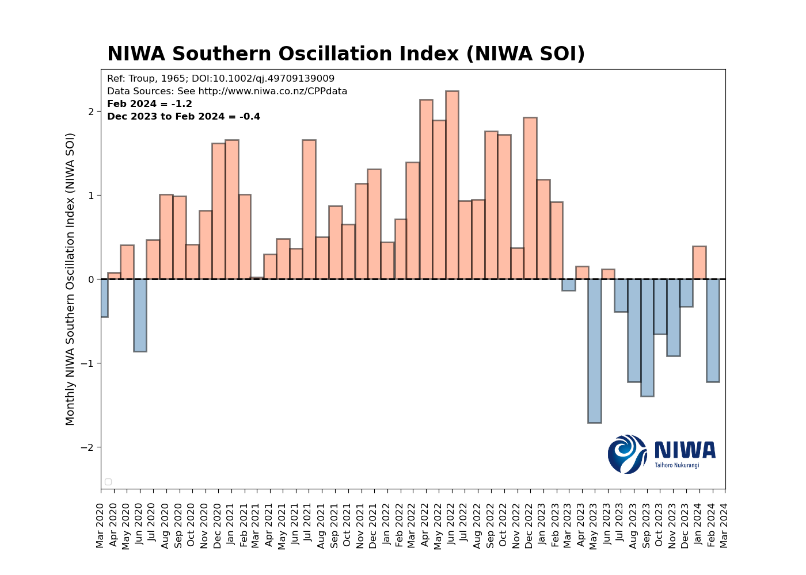
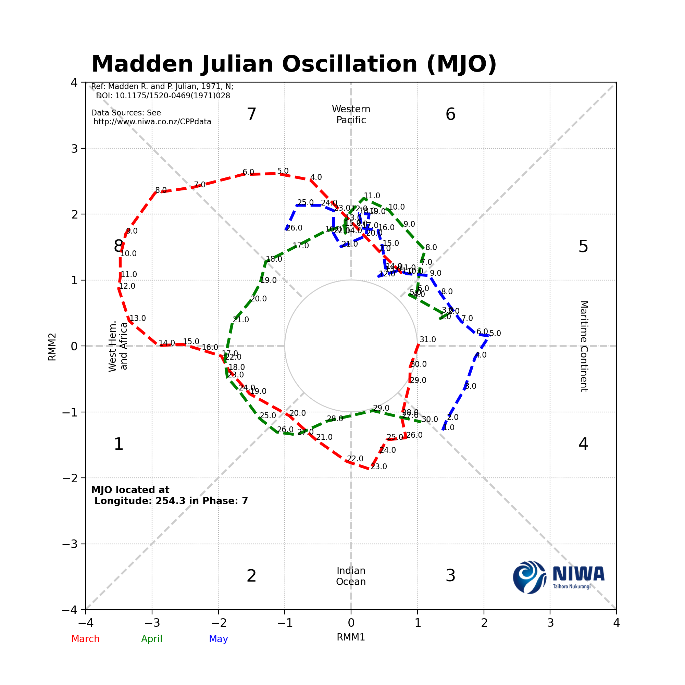

# CPP-Indices
<!--
To update TOC, please run:
> doctoc ./README.md --github
 -->
<!-- START doctoc generated TOC please keep comment here to allow auto update -->
<!-- DON'T EDIT THIS SECTION, INSTEAD RE-RUN doctoc TO UPDATE -->


  - [Live MJO](#live-mjo)
  - [Live SOI](#live-soi)
  - [Seven Station Series](#seven-station-series)
  - [Trenberth Index](#trenberth-index)
  - [IOD](#iod)
  - [IPO](#ipo)
  - [MonthlySOI](#monthlysoi)
  - [CEI](#cei)

## Updates:
1. Fixing bug associated with downloading ERA5 data.
2. Validated the Trenberth Indices from this catalogue
3. Validated and tested the SST data that comes from this catalogue

## Live MJO:

<a id="raw-url" href="https://raw.githubusercontent.com/nram812/cpp/main/data/mjo_data/phase_historical.csv">Download FILE</a>
<a href= download>Click to Download</a>
To access the data please download the following [link](data/mjo_data/phase_historical.csv)

## Live SOI:

To access the data please download the following [link](indices/data/daily_soi.csv)

# Seven Station Series

To access the data please download the following [link](seven_station_series_output/data/AllStationMonthly_Anomalies.csv)


# Trenberth Index


To download the indices please use the following [link](trenberth_figures/data/updated_trenberth_index.csv)
Notes: This is the new Trenberth Index correlates very well to Brett Mullan's maintained index. 
# IOD



To download the indices please use the following [link](IOD/figures/Monthly_IOD.csv)

# IPO

To download the indices please use the following [link](IPO/data/IPO_monthly.csv)

# MonthlySOI

To download the indices please use the following [link](niwa_soi/data/niwa-soi-latest.xlsx)


# CEI

To download the indices please use the following [link](CEI/data/CEI.csv)


# Methodology:
The aim of this project is to use data-driven techniques to post process the outputs of the GEFS.
The current methodology is based on a relatively simple statistical downscaling technique which is adapted from Kidson, 2000 and Lee et.al., 2019. See the following link for more information: https://simonleewx.com/gefs-35-day-north-american-regimes/.


### Data Source:
The data is downloaded from "https://nomads.ncep.noaa.gov/pub/data/nccf/com/gens/prod/" daily.

 ### Observational Clustering:
 NCEP geopotential heights (2.5 degree) are subjected to dimensionality reduction (Empirical Orthogonal Analysis), and Clustered into 5 synoptic regimes. These regimes are Trough, Northeasterly, Northerly High, Ridge and Westerly. These patterns aim to simplify and increase the signal to noise ratio in the extended forecast.

## Pipeline:
 1. Observations (1950 - present) of geopotential height have been subjected to 7 EOFs (95% of explained variance) and clustered using KMeans.
 2. The rainfall anomalies for each synoptic type is computed for each month of the year.
 3. NCEP GEFS data is regridded onto the same resolution as the NCEP geopotential heights, and projected onto the principal components of observational NCEP geopotential anomalies. These projected outputs are then further classified into one of 5 synoptic types. 
 4. The monthly outlook is calculated by weighting the rainfall anomalies for each synoptic type with the cluster frequency for each given day. 


The following "test" architecture is implemented to predict a synoptic type from the observations.

Research:
├── create_clustering
│   └── process_kidson_types_from_....
│   └── apply_predictions.py


## Running the Pipeline:
1. Login to the hpc (w-nwp01.maui.niwa.co.nz)
2. navigate to: /nesi/nobackup/niwa00004/rampaln/GEFS_forecast
3. Execute the bash script (bash_ensemble_run.sh)

Pipeline:
```
├── bash_scripts_auto
│   └── bash_ensemble_run.sh
```

```
├── download_gefs_data.py - Use multiprocessing downloads to speed up download speed.
├── process_gefs.py - Processes the outputs in the desired formats
├── send_gefs.py - Produces pretty images that are updated here. 
├── delete_files.py - periodically cleans up the directory.
```


```
console
    $w-nwp01 sh "/scale_wlg_nobackup/filesets/nobackup/niwa00004/rampaln/GEFS_forecast/bash_ensemble_run.sh"
```


# Live MJO Tracking
Here is a script that automatically tracks the MJO movement in real time.
<p float="center">
  
  
</p>

# Daily Nino Indices:
Below are the Nino1 and Nino2 Indices.
<p float="center">
  
  
</p>

Here are the Nino3.4 and Nino4 Indices
<p float="center">
  
  
</p>


# SAM and SOI Live Stream:

<p float="center">
  
  
</p>

# Monthly CEI Value:
<p float="center">
  
</p>

# Monthly IPO:
The following two series are the IPO at a monthly (left) and at a smoothed (11 year) rolling average.
<p float="center">
  
</p>

## IPO Trends
<p float="center">
  
  
</p>

## The IPO is calculated based on EOF analysis:
See the EOFS below:
<p float="center">
  
  
</p>
# The IOD (Indian Ocean Dipole):
See the EOFS below:
<p float="center">
  
</p>
## All trends
<p float="center">
  
</p>
## Current SST Pattern
<p float="center">
  
</p>


# NIWA SOI in Real Time:


# Seven Station Series in Real Time

This suite will be modified in the future


