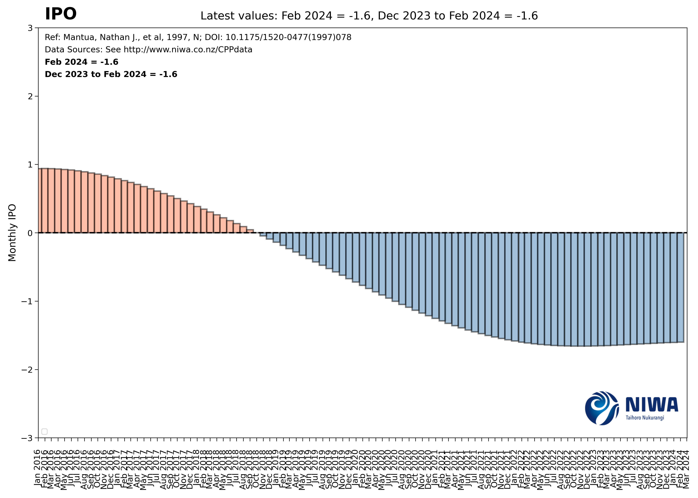
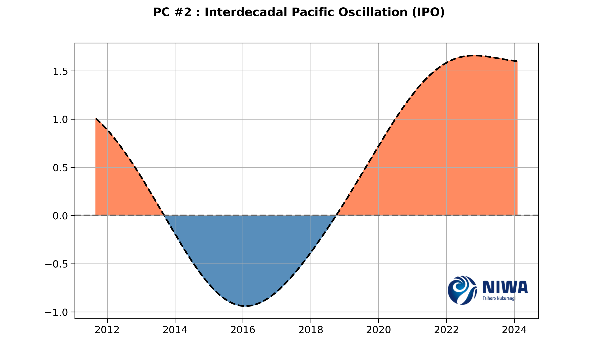
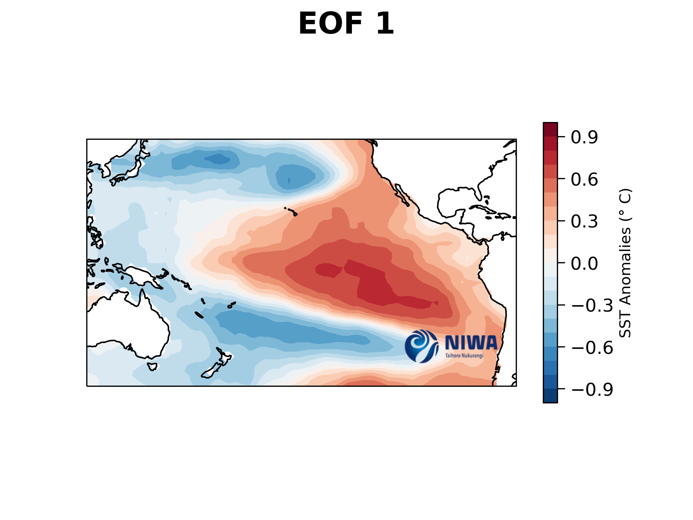
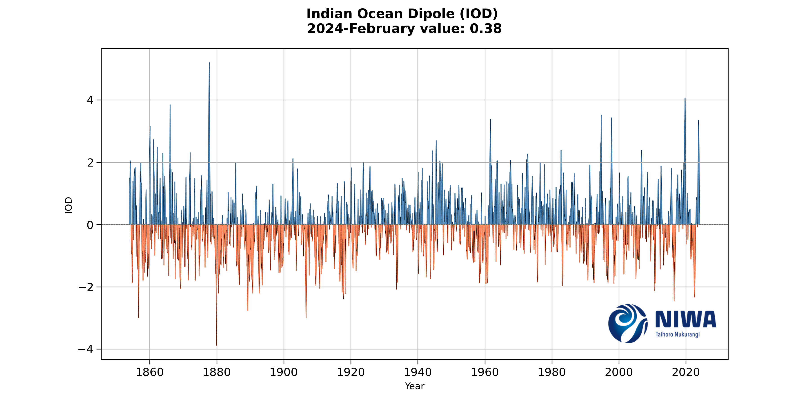

# CPP-Indices
## Things to Do 
1. To increase the spacing of the watermark (bigger whitespace in the png / border)
2. Remove the NIWA Ltd
3. Consistent upper left for the watermark.
4. Remove the black lines from the plot. 
5. Remove NIWA in front of the logos - Nino indices. 
6. Daily soi - last three months, ensure that the soi is also three years + remove niwa.ltd 
7. Take out NIWA - and write Coupled Enso index (CEI).
8. The key needs to go in the lower left corner - CEI. 
9. Beneath the NIWA CEI , have the december value, and the three month average.
10. shift the sevenstation series- latest value goes underneath the title.
11. Shift the axes from +4 to -4 in the plots. 
12. Mullan, et.al - add the metadata. - methodology description. 
13. MJO - title and change the key for these plots. 
14. I will add the metadata in a separate text file to the top of each plot
15. Position of the values (e.g. December: bottom left )
16. Titles go top right - make sure this is consistent with the plot height. 
17. Key goes in the top left. 
18. Remove the lines from the cei plots. 
19. CC-BY-NC needs to be hardwired into everything
20. Remove the whitespace in the plots (CEI for the left side. - use 36 months from present data)
21. Add other regions to the seven-station-series. 

# Live MJO Tracking
Here is a script that automatically tracks the MJO movement in real time.

  
  

# Daily Nino Indices:
Below are the Nino1 and Nino2 Indices.

  
  

Here are the Nino3.4 and Nino4 Indices

  
  

# SAM and SOI Live Stream:

  
  

# Monthly CEI Value:

  

# Monthly IPO:
The following two series are the IPO at a monthly (left) and at a smoothed (11 year) rolling average.

  

## IPO Trends

  
  

## The IPO is calculated based on EOF analysis:
See the EOFS below:

  
  

# The IOD (Indian Ocean Dipole):
See the EOFS below:

  

## All trends

  

## Current SST Pattern

  

# NIWA SOI in Real Time:

# Seven Station Series in Real Time

This suite will be modified in the future

